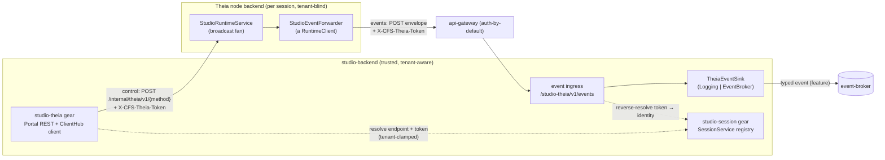
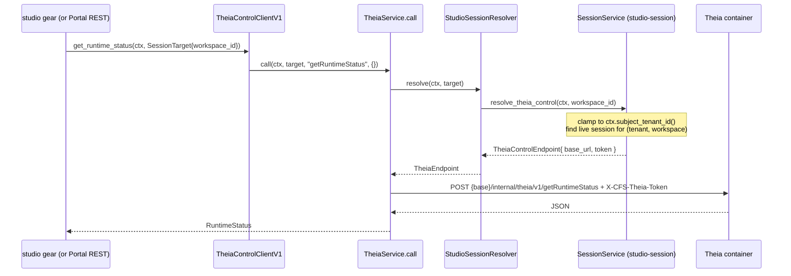

# studio-backend ↔ Theia bridge — architecture (ADR-0010)

Status: phase 3. Rust side compile-verified under `--features theia-bridge` and
`--features theia-event-broker` (build + `clippy -D warnings`). Theia (node) side
not yet built locally (blocked on X11 dev libs, see §9). Broker *publish* not yet
live (needs the broker linked + topic/schema registered, see §8).

This document explains how studio-backend and the per-session Theia node backend
talk to each other, the identity/trust model that makes it safe across tenants,
and how to inspect the surface and exercise it live.

---

## 1. The shape in one paragraph

Each IDE session is a **Theia node backend** running in its own container. It is
**tenant-blind**: it knows its own workspace, not who owns it. studio-backend owns
the tenant boundary. Two independent planes cross the gap:

- **Control plane — studio → IDE.** studio-backend calls the container to drive
  the IDE (status, repos, enqueue a commit, open a file). Synchronous, initiated
  by studio-backend, tenant-clamped *before* the call leaves the trusted side.
- **Event plane — IDE → studio.** The container pushes what happens inside it
  (operation progress, audit, repo/workspace changes) back to studio-backend.
  Asynchronous, best-effort, initiated by the container.

Both planes authenticate with the **same per-session S2S token** (`control_token`,
256 bits), minted by studio-session and injected into the container's env. The
control plane trusts the token because studio-backend dials a known endpoint; the
event plane trusts it by **reverse-resolving** it back to `(tenant, workspace,
session)` — the request body is never trusted for identity.



---

## 2. Components

| Component | Where | Role |
|---|---|---|
| `studio-theia` gear | `studio-backend/src/studio_theia/` | The bridge. Publishes the control client, mounts Portal REST + the event ingress. Gated behind `theia-bridge`. |
| `TheiaControlClientV1` | `studio_theia/sdk/client.rs` | Object-safe, in-`ClientHub` contract other gears call to drive an IDE. Tenant boundary enforced here. |
| `TheiaService` | `studio_theia/service.rs` | HTTP client + resolvers. `call()` dials the container; holds the endpoint resolver and the token reverse-resolver. |
| `StudioSessionResolver` | `studio_theia/discovery.rs` | Bridges to studio-session via `ClientHub`. Implements both `TheiaEndpointResolver` (control) and `ControlTokenResolver` (events). |
| `TheiaEventSink` | `studio_theia/sink.rs` | Policy seam for forwarded events. `LoggingEventSink` (default) / `EventBrokerEventSink` (feature). |
| `SessionService` | `studio-backend/src/studio_session/service.rs` | In-memory session registry; mints tokens; resolves endpoint + reverse-resolves token. |
| `StudioRuntimeService` | `theia/studio/src/node/studio-backend-module.ts` | The node backend endpoint: owns the operation journal and the broadcast fan of `StudioRuntimeClient`s. |
| `StudioEventForwarder` | `theia/studio/src/node/studio-event-forwarder.ts` | A non-browser `StudioRuntimeClient` added to the fan; POSTs every broadcast to the ingress. |

---

## 3. Control plane — studio → IDE

### Flow



The **tenant clamp happens on the trusted side**: `resolve_theia_control` filters
the session registry by `ctx.subject_tenant_id()`, so a caller can only ever reach
a session in their own tenant. The container itself receives a request with no
tenant in it — it cannot leak across tenants because it never learns of others.

### The v1 method surface (`TheiaControlClientV1`)

| Rust method | Wire method (`/internal/theia/v1/…`) | Portal REST | Purpose |
|---|---|---|---|
| `get_runtime_status` | `getRuntimeStatus` | `GET  …/workspaces/{id}/status` | IDE readiness + event cursor |
| `get_session_info` | `getSession` | `GET  …/workspaces/{id}/session` | Session identity + feature flags |
| `get_repositories` | `getRepositories` | `GET  …/workspaces/{id}/repositories` | Repos the IDE has mounted |
| `enqueue_operation` | `enqueueOperation` | `POST …/workspaces/{id}/operations` | Queue a save/commit/push |
| `get_operation_deltas` | `getOperationDeltas` | `GET  …/workspaces/{id}/operations?afterSequence=` | Cursor backfill of op events |
| `retry_operation` | `retryOperation` | `POST …/workspaces/{id}/operations/{opId}/retry` | Retry a failed operation |
| `open_in_editor` | `openInEditor` | `POST …/workspaces/{id}/open` | Reveal/open a file in the IDE |

Portal routes are registered with `OperationBuilder…​.authenticated()` — the
api-gateway enforces the platform token, and the caller's `SecurityContext` scopes
them by tenant. DTOs live in `studio_theia/sdk/models.rs` (`SessionTarget`,
`RuntimeStatus`, `SessionInfo`, `RepositoryDescriptor`, `EnqueueOperation(+Result)`,
`OperationDeltas`/`OperationEvent`, `OperationSnapshot`, `OpenInEditor(+Result)`).

---

## 4. Event plane — IDE → studio

### Flow

```mermaid
sequenceDiagram
    participant Node as StudioRuntimeService (node)
    participant Fan as broadcast fan (Set<StudioRuntimeClient>)
    participant Fwd as StudioEventForwarder
    participant GW as api-gateway
    participant Ing as event ingress
    participant Sess as SessionService
    participant Sink as TheiaEventSink

    Node->>Fan: broadcast(client => client.onOperationEvent(e))
    Fan->>Fwd: onOperationEvent(e)
    Fwd->>GW: POST /studio-theia/v1/events<br/>{session:{workspaceId}, kind, sequence?, event}<br/>+ X-CFS-Theia-Token
    GW->>Ing: (route is anonymous+exposed → not auth-gated)
    Ing->>Sess: resolve_control_token(token)
    Sess-->>Ing: SessionIdentity{ tenant_id, workspace_id, session_id }
    Note over Ing: body.workspaceId is advisory;<br/>identity comes from the token
    Ing->>Sink: accept(TheiaForwardedEvent{ trusted ids, kind, sequence, payload })
    Sink-->>Ing: (best-effort)
    Ing-->>Fwd: 202 Accepted
```

### The forwarder sits in the same fan as the browser

`StudioRuntimeService` keeps a `Set<StudioRuntimeClient>`. Browser IDE tabs join it
over RPC; `StudioEventForwarder` is added as **one more client** whenever the bridge
is provisioned (env present). So *every* event the browsers receive, studio-backend
receives too — no separate event model, no new emit sites. `broadcast()` swallows
per-client errors, and the forwarder's own network errors are swallowed inside it,
so a bridge blip never blocks delivery to the browser.

### The event surface (`StudioRuntimeClient`) — all five forwarded

| Callback | Envelope `kind` | Ordered? | Forwarded |
|---|---|---|---|
| `onOperationEvent` | `operation` | yes (`sequence`) | ✅ |
| `onAuditEvent?` | `audit` | yes (`sequence`) | ✅ |
| `onRepositoriesChanged` | `repositories-changed` | no | ✅ |
| `onWorkspaceSnapshotChanged?` | `workspace-snapshot-changed` | no | ✅ |
| `onWorkspaceActivityEvent?` | `workspace-activity` | no | ✅ |

Envelope on the wire: `{ session: { workspaceId }, kind, sequence?, event }`, where
`event` is the callback argument **verbatim**. Provisioning is env-driven
(`STUDIO_THEIA_S2S_TOKEN` + an ingress URL, derived from `STUDIO_GATEWAY_URL` when
not explicit); absent them, the forwarder is never constructed.

### The sink seam

The ingress is transport; the sink is policy. `TheiaForwardedEvent` carries the
**trusted** `tenant_id` / `workspace_id` / `session_id` (from the token, not the
body) plus `kind`, `sequence`, `payload`.

- `LoggingEventSink` (default) — structured trace, zero infra. Keeps the loop
  observable end-to-end before any broker exists.
- `EventBrokerEventSink` (`--features theia-event-broker`) — republishes each event
  as a typed event onto `event-broker`, tenant-scoped, with a **per-tenant cached
  producer** (so `prepare_all` runs once per tenant, not per event). GTS
  topic/type/subject ids are **placeholders** pending registration.

---

## 5. Identity & trust model

Two per-session tokens, both minted by studio-session, distinct on purpose:

| Token | Plane | Presented as | Guards |
|---|---|---|---|
| `session_token` | browser → IDE | `?token=` → HttpOnly cookie | The container's own 256-bit gate on the reverse proxy |
| `control_token` | studio ↔ IDE (S2S) | `X-CFS-Theia-Token` header | Both bridge planes; env var `STUDIO_THEIA_S2S_TOKEN` in the container |

`control_token` is two v4 UUIDs concatenated (256 bits). Where identity matters:

- **Control plane:** identity is the *caller's* `SecurityContext`; the token only
  proves studio-backend to the container. Tenant clamp is applied before dialing.
- **Event plane:** the token *is* the credential the ingress mints identity from.
  `resolve_control_token` finds the live session carrying that token and returns its
  authoritative `(tenant, workspace, session)`. A forged `session.workspaceId` in the
  body cannot cross-tenant an event — the body is advisory.

### Gateway posture (why the ingress is `anonymous().exposed()`)

api-gateway is **auth-by-default** (`require_auth_by_default`). A raw route is
401'd before it reaches the handler. The ingress is therefore registered as an
`OperationBuilder…​.anonymous().exposed()` operation — `exposed()` puts the path in
the gateway's public-route set; `anonymous()` keeps the platform auth layer off; the
S2S-token check inside the handler is the real auth. Same pattern the IDE reverse-
proxy routes use.

---

## 6. Session lifecycle & discovery

`SessionService` holds an in-memory `RwLock<HashMap<Uuid, Session>>`, keyed by
session id, idempotent on `(tenant, workspace)`. Each `Session` carries
`workspace_id`, `tenant_id`, `handle` (container id / Pod name), `address`, `state`,
`session_token`, `control_token`.

- **On launch** (`theia_control_enabled`): mint `control_token`, inject
  `STUDIO_THEIA_S2S_TOKEN` + `STUDIO_GATEWAY_URL` into the container env.
- **Endpoint resolution:** `SessionAddress` is either `Loopback { port }` (Docker
  MVP → `http://{control_reach_host}:{port}`) or `Service { host, port }` (k8s).
- **Reverse resolution:** scan the registry for the session whose `control_token`
  matches (plain `==`; constant-time compare is a cheap future hardening).

The `studio-theia` gear looks the discovery client up **lazily** from `ClientHub`,
so gear init order does not matter and studio-session need not be up first.

---

## 7. Networking topology

- **studio → container (control):** direct HTTP to the resolved `base_url`
  (`/internal/theia/v1/{method}`). Docker: loopback port; k8s: internal Service.
- **container → gears:** `STUDIO_GATEWAY_URL=http://host.docker.internal:8090/cf`.
  The session gate proxies `/studio-api/*` to the gears same-origin (no CORS, no
  server-side token storage). `/cf` is the api-gateway prefix.
- **browser → IDE:** reverse proxy `/studio-session/v1/ide/{id}/…`
  (`anonymous().exposed()`), gated by the session's own `?token=`→cookie.
- **container → studio (events):** POST to the ingress URL derived from the gateway
  URL (`…/studio-theia/v1/events`).

---

## 8. Feature flags & current state

| Feature | Effect | Default | Verified |
|---|---|---|---|
| `theia-bridge` | Links the whole `studio_theia` gear (module is `#[cfg]`'d). | OFF | build + `clippy -D warnings` ✅ |
| `theia-event-broker` | Swaps in `EventBrokerEventSink`, pulls `event-broker-sdk`. Implies `theia-bridge`. | OFF | build + `clippy -D warnings` ✅ |

Config gates (runtime): `studio-theia.enabled`, studio-session `theia_control_enabled`.
Disabled → endpoints still mount and answer `503` with a reason.

**Not yet live (integration / infra, not compile):**

1. **Broker link.** `event-broker` (`deps=[cluster]`, `capabilities=[rest, stateful]`)
   is not linked in this build and needs a storage backend. Until then
   `prepare_all`/`publish` return errors (logged best-effort; the loop does not fail).
2. **Topic/type/schema registration.** The GTS ids in `sink.rs` are placeholders;
   the topic + event-type + schema must be registered in the types-registry before a
   publish succeeds.
3. **Broker authorization** of the bridge's hand-built `SecurityContext` for the
   topic — an integration-time check.
4. **Theia node build** blocked locally on X11 dev libs (see §9).

---

## 9. How to explore the capabilities now

### Read the interface surface

- **Control (studio → IDE), v1:** `studio_theia/sdk/client.rs` — the 7 methods in §3.
- **Events (IDE → studio):** `theia/studio/src/common/studio-protocol.ts`,
  `interface StudioRuntimeClient` — the 5 callbacks in §4.
- **The full Theia node surface (expansion candidates):** in the same file,
  `interface StudioRuntimeService` exposes far more than the bridge surfaces today —
  workspace-config mutation (`addWorkspaceSource`, `updateWorkspaceSource`,
  `removeWorkspaceSource`, `renameWorkspace`, `read/saveWorkspaceRawToml`),
  migrations (`preview/apply/rollback/activateWorkspaceMigration`), and sync
  (`start/confirm/cancelWorkspaceSync`). Each is a candidate for a new v1+ control
  method: add a `TheiaControlClientV1` method → a `TheiaService.call("<wireName>")`
  → a Portal route, mirroring the existing seven. **This is where "what we can add"
  lives.**

### Bring it up and poke it

1. Enable: build studio-backend `--features theia-bridge` (or `theia-event-broker`),
   set `studio-theia.enabled=true` and studio-session `theia_control_enabled=true`.
2. Launch a session (studio-session) → the container gets `STUDIO_THEIA_S2S_TOKEN`
   + `STUDIO_GATEWAY_URL`, and the forwarder self-arms.
3. **OpenAPI:** the Portal routes register under tag `StudioTheia`; hit the running
   backend's OpenAPI/Swagger surface (via the gateway) to see them and try them.
4. **Drive the IDE:** call `GET …/workspaces/{id}/status|session|repositories`,
   `POST …/operations`, `POST …/open` under an authenticated request.
5. **Watch events:** with `LoggingEventSink`, tail studio-backend logs for
   `studio-theia: received forwarded Theia event` (fields: `tenant`, `workspace`,
   `session`, `kind`). With the broker sink, consume the topic once it's registered.

### Unblock the node build (local)

```bash
sudo apt-get update
sudo apt-get install -y libx11-dev libxkbfile-dev libsecret-1-dev build-essential pkg-config
cd theia && npm ci && cd studio && npm run build
```

`native-keymap` (a Theia dep) needs the X11 dev headers; without them `npm ci`
aborts before our TypeScript ever compiles.

---

## 10. Next steps

- Confirm the GTS topic/event-type/subject names and register the schema.
- Decide the `event-broker` link (cluster + storage backend + topic provision).
- Build the Theia node side and run the loop end-to-end with `LoggingEventSink`.
- Pick the first expansion method from the `StudioRuntimeService` gap (§9) if the
  bridge needs to do more than observe + drive commits/opens.
